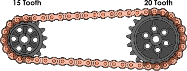

# Жетілдірілген жұлдызшалар пен Шынжыр

## Жұлдызшалар және Шынжыр физикасы

Жұлдызшалар-бұл қуатты берудің және механикалық жүйенің Шығыс моментін немесе жылдамдығын өзгертудің кең таралған тәсілдерінің бірі. Осы негізгі ұғымдарды түсіну оңтайлы дизайн шешімдерін қабылдау үшін өте маңызды. Бұл бөлімде осы ұғымдардың анықтамасы қысқаша қарастырылады, содан кейін олардың жұлдыздар мен Шынжырдың негізгі құрылымдарына қатынасы түсіндіріледі.



**Жылдамдық**-бұл Нысанның қаншалықты жылдам қозғалатындығының өлшемі. Нысанның жылдамдығы оның белгілі бір уақыт аралығында қанша қашықтыққа ұшатынын көрсетеді. SI-дегі жылдамдық бірлігі секундына метр, бірақ жылдамдық әдетте секундына футпен көрсетіледі.



**Aйналу Моменті**-бұл жұлдызша немесе доңғалақ сияқты заттың айналу күшінің өлшемі. Математикалық тұрғыдан айналу моменті объектінің бұрыштық импульсінің өзгеру жылдамдығы ретінде анықталады. Моменттің әдеттегі мысалы-болтқа бекітілген кілт, ол оны қатайту немесе босату үшін момент жасайды. Момент әдетте Нм немесе фунтпен көрсетіледі. Aйналмалы затты, мысалы, жұлдызшаны айналдырғанда, жұлдызша тістердің тізбекпен жанасу орнында түзу (сызықтық) күш жасайды. Пайда болған айналу моментінің шамасы қолданылған айналу күшіне және атқару тұтқасын іске асыруға тең, ол жұлдызша жағдайында қадам диаметрінің (радиустың) жартысына тең.




Қуат (P) - белгілі бір уақыт ішінде жұмыс істеу жылдамдығы. Қуат ұғымы физикалық өзгерісті де, өзгеріс болатын уақыт кезеңін де қамтиды. Бұл тек физикалық өзгерісті өлшейтін жұмыс ұғымынан өзгеше. Кірпішті жоғары қарай жылжыту үшін сіз барсаңыз да, жүгірсеңіз де бірдей жұмыс қажет, бірақ жұмыс қысқа уақыт ішінде орындалатындықтан, жүгіру кезінде көбірек энергия жұмсалады. Қуат үшін SI бірлігі секундына бір Джоуль (Дж/с) болатын ватт (Ватт) болып табылады. Көбінесе бәсекеге қабілетті робототехникада жалпы қуат қозғалтқыштармен және қол жетімді батареялармен анықталады. Қолдың белгілі бір жүкті көтере алатын максималды жылдамдығы жүйенің максималды қуатына байланысты.




## Шынжырлы жетек

Кіріс жұлдызшасына қатысты әртүрлі өлшемдегі жұлдызшаларды таңдау арқылы шығыс жылдамдығы мен Шығыс моментін өзгертуге болады. Бұл өзгерістер жалпы қуатқа әсер етпейді. Жұлдызша мен Шынжыр-моментті ұзақ қашықтыққа берудің өте тиімді әдісі.&#x20;

Тісті доңғалақтар мен Шынжыр көмегімен орташа төмендеулерге қол жеткізуге болады, бірақ берілістер әдетте беріліс қатынасының үлкен төмендеуіненоеам шешім ұсынады.

### Жұлдыздардың қатынасы

Үлкен жұлдызша кішісін қозғалысқа келтіргенде, үлкен жұлдызшаның бір айналымында кіші жұлдызша көбірек айналым жасауы керек, сондықтан Шығыс кіруге қарағанда жылдамырақ болады. Егер жағдай керісінше болса және кіші жұлдызша Үлкен Шығыс жұлдызшасын қозғалысқа келтірсе, онда кіріс жұлдызшасының бір айналымында Шығыс аз айналым жасайды, бұл кіріспен салыстырғанда жылдамдықтың төмендеуіне әкеледі. Екі жұлдызшаның өлшемдері олардың арасындағы жылдамдық пен моменттің өзгеруіне пропорционалды.

Жұлдыздардың кіріс (жетекші) және шығыс (құл) өлшемдерінің қатынасы Шығыс жылдамырақ (аз айналу моменті) немесе үлкен айналу моменті (баяу) болатынын анықтайды. Жұлдызша өлшемдерінің қатынасы кіріс пен Шығыс байланыстарының арақатынасына қалай әсер ететінін дәл есептеу үшін екі жұлдызша арасындағы тіс санының арақатынасын пайдаланыңыз.&#x20;

Төмендегі суретте кіріс және шығыс жұлдызшаларының тістерінің арақатынасы 20T:15T құрайды, яғни кіріс жұлдызшасы бір айналым жасау үшін 1,3 айналым жасауы керек.

$$
20T/15T=1.320T/15T =1.3
$$

### Idlers

Енді мысалға тізбектің сыртынан 15 тісті **Idler** жұлдызшасын қосайық. **Idler** жұлдызы-бұл білікке жетелемейтін және ешқандай жұмыс жасамайтын Шынжыр кез-келген жұлдызша. Жұлдызшалар **idler** 20T:15T болып қалатын жүйенің редукциясын өзгертпейді.


Независимо от количества или размера ведомых звездочек, только входная и выходная звездочки определяют редукцию.


!\[]\(https://2589213514-files.gitbook.io/\~/files/v0/b/gitbook-legacy-files/o/assets%2F-M5yw0n8IneF5-9ybLjT%2F-MlCOLD9yV77RAn9zLz3%2F-MlCPp\_UtOIbUOYtCdRP%2F15T20T%20w%20idler. png?alt=media\&token=3c5e416f-cb65-49a1-a2ae-42c7e9a10a6b)

Шынжырдың бір жағындағы барлық жұлдызшалардың айналуы бірдей. Жетекші және жетекші жұлдызшалар шынжырдың ішінде және сағат тіліне қарсы айналады, ал жетек жұлдызшасы шынжырдың контурынан тыс және сағат тілімен айналады. Бұл қасиет бір көзден қуат алатын, бірақ қарама-қарсы айналатын екі білік болған жағдайда пайдалы. Мұның роботтардағы жиі кездесетін мысалдары-су қабылдағыштар мен екі доңғалақты көрсеткілер.

Idlers шынжырды тарту немесе жұлдызшаның айналасындағы шынжырдың айналу дәрежесін арттыру үшін пайдалануға болады. Төмендегі суреттен көріп отырғаныңыздай, барлық беріліс қорабының жұлдызшаларында жұлдызшаның айналасында шамамен 180° оралған шынжыр болуы керек. Мұндай бұрылыстар шынжырдың тістері шынжырға ілініп, айналу моментін беру үшін қажет. Тым аз бұралу (<120°) ауыр жүктеме кезінде тізбектің сырғып кетуіне әкелуі мүмкін, ал шамадан тыс нови (>200°) жүйенің тиімділігін төмендетуі мүмкін. Шынжырдың сыртында орналасқан жұлдызша ескертумен белгіленеді, өйткені оның шынжыр шеңбері <90°. Егер бұл жұлдызша құл болса, онда ол қозғалмайды және шынжырдың минималды бұрылысы делік, бірақ егер бұл жұлдызша жұмысты орындайтын білікті қозғалысқа келтірсе, онда мұндай бұрылыс жеткіліксіз болады.

!\[]\(https://2589213514-files.gitbook.io/\~/files/v0/b/gitbook-legacy-files/o/assets%2F-M5yw0n8IneF5-9ybLjT%2F-MlBc0FwJnSQAJoJGTWG%2F-MlBf0rOcHj4jUHrcQB5%2Fgoogle%20doc%2015T20T%20sprocket%20w%20idler%20wrap. png?alt=media\&token=9bbbfb5d-011d-4ecc-afe8-ad58a46cab21)

Жұлдызша мен шынжыр-бұл жұмыста моментті ұзақ қашықтыққа берудің тиімді әдісі. Мұның жалпы мысалы-жұлдызшалар мен шынжырлы беріліс қорабы. Бұл мысалда ұштарындағы жұлдызшалар жетекші дөңгелектермен байланысады, ал орталық жұлдызша қозғалтқышпен қозғалады (көрсетілмеген). Жүргізуші мен басқарушы жұлдызшалар шынжырдың ішінде болғандықтан, олардың барлығы бірдей айналу бағытына ие. Шынжырдың ілмегінің сыртында орналасқан кішірек жұлдызшалар шынжырдың орталық жетекші жұлдызшаға оралу дәрежесін арттыру үшін қолданылады.

### Құрама беріліс

Кейбір конструкциялар бір сатыда мүмкін болғаннан көбірек төмендетуді қажет етуі мүмкін. Ең кішкентай жұлдызшадан ең үлкенге дейінгі арақатынас 54:15 құрайды, сондықтан 3,6 x-тен көп азайту қажет болса, бір механизмде бірнеше азайту қадамдарын қолдануға болады, бұл аралас беріліс деп аталады. Құрама редукторда әрқайсысы жалпы осьпен байланысқан бірнеше жұп тісті доңғалақтар немесе жұлдызшалар бар. Жұлдызшалар мен тізбектерді көп сатылы редакцияда қолданған кезде бірінші сатыда берілістер, ал соңғы сатыда жұлдызшалар мен шынжыр жиі қолданылады. Төмендегі суретте барлық берілістерді қолдана отырып, екі сатылы редукцияның мысалы келтірілген, бірақ жұптардың бірін жұлдызшалар мен тізбектерге ауыстыруға болады. Әр жұптың жетек берілісі (кірісі) қызғылт сары түспен ерекшеленеді.

Қысқарту тісті доңғалақтар мен шынжыр үшін тіс санының арақатынасы негізінде бірдей есептеледі. Композиттік редукцияның жалпы төмендеуін есептеу үшін әр қадамның төмендеуін анықтаңыз, содан кейін әр төмендеуді бірге көбейтіңіз.

$$
\text{CR}=\text{R}_1×\text{R}_2 ×\text{…} ×\text{R}_n
$$

**Мұнда:**

* CR - қосылыстардың жалпы қысқаруы
* Rn - әр кезеңнің жалпы қысқаруы

Жоғарыдағы суреттің мысалында қосылыстың төмендеуі 12:1 құрайды.

$$
\text{CR}=\text{R}_1× \text{R}_2 =\frac{60}{30}× \frac{90}{15}=2 ×6=12
$$

Кез-келген беріліс жүйесі үшін редукторлар мен тісті доңғалақтардың өлшемдері шектеулі, сондықтан композициялық редукциялармен үлкен редукциялар жасау мүмкіндігінен басқа, редукция мәндерінің кең ауқымын немесе бірдей бір сатылы редукцияны жасауға болады, бірақ кіші диаметрлі қозғалыс компоненттерімен.


Әрбір қосымша құрама кезең жүйенің тиімділігінің төмендеуіне әкеледі.


### Интервалдар және орталықаралық қашықтықтар 

REV robotics жұлдызшаларын [Extrusion ](https://www.revrobotics.com/ftc/structure/15mm-extrusion/)немесе [Channel ](https://www.revrobotics.com/competition/ftc/structure/channel/)ойықтарымен бірге қолданған кезде, осьтер арасындағы Орталық қашықтық толығымен реттеледі. Шынжырдың керілуін реттеу үшін біліктің бекіту тақталарын ойықтар бойымен кез келген жерде сырғытыңыз және қатайтыңыз. Бұл жүйе икемділіктің жоғары деңгейін қамтамасыз ететін REV robotics үйлесімді жұлдыздарының кез келген комбинациясын бірге пайдалануға мүмкіндік береді. Жүйе жылдамдығының төмендеуін реттеу кезінде тек бір жұлдызшаны ауыстыруға болады, бұл құрастыру уақытын қысқартады.

\[Extended Motion pattern] (broken-reference) ішіндегі қадамды пайдаланған кезде, ұқсас икемділік деңгейіне M3 ([REV-41-1492](https://www.revrobotics.com/rev-41-1492/)) тіректері бар кернеу жеңдерін ([REV-41-1702](https://www.revrobotics.com/rev-41-1702/)) пайдалану арқылы жұлдызшалар арасындағы қашықтықта қол жеткізуге болады.

### Жұлдызшалар арасындағы қашықтық

Жұлдызшалардың тиімді жұмыс істеуі үшін **орталықаралық қашықтықты** дұрыс реттеу маңызды. Төмендегі суреттегі жұлдызша мен шынжырдың мысалы "X;" өте аз жүктемелерде жұмыс істей алады, бірақ олар жұмыс істемейді және кез-келген маңызды жүктеме кезінде секіреді. Бұл мысалдағы жұлдызшалар бір-біріне тым жақын орналасқан, сондықтан шынжырдың әлсірегені соншалық, ол жұлдызшалардың тістерінен өтіп кетуі мүмкін. Жасыл жалауы бар жұлдызшалар дұрыс орналастырылған, бұл тегіс және сенімді жұмыс істеуге мүмкіндік береді.

**REV robotics жұлдызшаларын ойықтарға дұрыс орнату үшін келесі процедураны қолданыңыз:**

1. Кіріс немесе шығыс жұлдызшасының осін мықтап бекітіңіз. Бірнеше беріліс берілісі немесе құрама редукциясы бар беріліс жағдайында, ең бірінші кіріс берілісі немесе ең соңғы беріліс сияқты қай осьті бекітудің мағынасы бар екенін қарастырыңыз.
2. Бекітілген осьтен бастап, осы осьтегі барлық жұлдыздар үшін барлық жетекші және жетекші жұлдыздарды анықтаңыз. Бұл осьтерді кезекпен босатыңыз, оларды шынжыр тартылғанша сырғытыңыз, содан кейін осьтік бекіткіштерді қайтадан қатайтыңыз.
3. Әрбір бекітілген ось үшін процедураны 2-қадамнан бастап барлық шынжырлар тартылғанша және барлық осьтер тартылғанша жалғастырыңыз.


Жоғарыда сипатталған процесс слоттармен жұмыс істейді, бірақ кеңейтілген қозғалыс үлгісі бар процесс орталықтар арасындағы қашықтықты есептеуді қажет етуі мүмкін


**Орталықтан орталыққа дейінгі қашықтық**

Екі жұлдызша арасында қажетті сілтемелер санын немесе берілген шынжыр ұзындығындағы екі жұлдызша үшін дұрыс осьаралық қашықтықты математикалық түрде есептеуге болады. Бұл әдістер жоспарлау мақсаттарына сәйкес келеді жұмыс, бірақ роботты осы өлшемдерді қолдана отырып құрастыру әдетте практикалық емес. Бұл есептеулердің егжей-тегжейлері кескіндеменің толықтығы үшін енгізілген, бірақ қазіргі заманғы CAD пакеттерінің көпшілігі немесе көптеген тегін онлайн калькуляторлар да дұрыс мәндерді жасай алады.

**Орталықтан орталыққа дейінгі қашықтық дюйммен**

####

$$
\text{CDC} = \frac{P}{8}\left[2L - (N+n) + \sqrt{(2L-(N+n))^2-\frac{8}{\pi^2}\times(N - n)^2} \right]
$$

**Тізбектің ұзындығы қадамдармен**

$$
L = \frac{2C}{P} + \frac{N+n}{2} + \frac{P(\frac{N -n}{2\pi})^2}{C}
$$

**Мұнда:**

* C= Орталықтан орталыққа дейінгі қашықтық
* L= Астарлы әңгімелердегі шынжырдың ұзындығы
* P= Шыжыр қадамы
* N= Үлкен жұлдызшадағы тістердің саны
* n= Кішкентай жұлдызшадағы тістердің саны.

**Орталық қашықтықты есептеу**

**"Орталықтан орталыққа дейінгі қашықтық дюйммен"** формуласын және жоғарыдағы суреттегі шынжырды беру мысалын пайдаланып орталықтан орталыққа дейінгі қашықтықты есептеңіз.

**Мұнда:**

* L = 48
* P = 0.25
* N = 20
* n = 15

$$
\text{CDC} = \frac{0.25}{8}\left[2(48) - (20+15) + \sqrt{(2(48)-(20+15))^2-\frac{8}{\pi^2}\times(20 - 15)^2} \right]\newline= \frac{0.25}{8}\left[ 96 - 35 +\sqrt{(96-35)^2 - \frac{8}{\pi^2}\times (5)^2} \right]\newline=\frac{0.25}{8} \left[ 61 + \sqrt{(61)^2 - \frac{8}{\pi^2}\times25}\right]\newline = \frac{0.25}{8}\left[ 61 + \sqrt{3721 - \frac{200}{\pi^2}}\right]\newline\frac{0. 25}{8}\left[61+\sqrt{3721-20.24642}\right]\newline = 0.03125\left[61+60.833\right]\newline = 3.807
$$

Есептеулерден кейін мысал үшін орталықтан орталыққа дейінгі қашықтық **3,807 дюймді** құрайды.

**Шынжырдың ұзындығын есептеңіз**

Көп жағдайда шынжырдың ұзындығы алдын-ала белгісіз, бірақ редуктордағы екі тісті доңғалақ және Редукторды орнату үшін қажет центраралық қашықтық белгілі. Бұл мысал үшін 20:15 қысқарту қажет және барлық ерітінді бес дюймден аспайтын кеңістікке сәйкес келуі керек.

Бұл мысалда барлық шешімдер бес дюймдік кеңістікке сәйкес келуі керек, сондықтан орталықаралық қашықтықтан басқа, екі жұлдызша үшін де шынжырдың Саңылау радиусын ескеру қажет. 15 және 20 тісті жұлдызшалар үшін шынжырдың саңылауының диаметрін табу үшін **жұлдызшаны өлшеу мәліметтерін** пайдаланыңыз және орталықтар арасындағы максималды қашықтықты алу үшін берілген шешімнің жалпы өлшемінің әрқайсысының радиусын алып тастаңыз. қол жетімді.

$$
\text{Maximum CDC} = \text{Total Solution Width} - \text{Clearance Radius 1}-\text{Clearance Radius 2}
$$

**Мұнда:**

$$
\text{Total Solution Width} = 5 \text {inches}\newline\text{Clearance Radius 1}\,=15T_{chain\, clearance\, diameter(A)} = 1.45\,\text{inches}\newline\text{Clearance Radius 2} =20T_{chain\, clearance\, diameter(A)} = 1.85\,\text{inches}
$$

$$
\text{Maximum CDC Available} = 5 - \frac{1.45}{2} - \frac{1.85}{2}\newline\text{Maximum CDC Available} = 3.35 \text{inches}
$$

Бұл кішірейту үшін максималды аралық ретінде орталықтан орталыққа дейінгі қашықтықты 3,371 дюймді пайдаланып, бес дюймдік кеңістікке сәйкес келу үшін шынжыр ұзындығының теңдеуін қадаммен шешіңіз.

**Мұнда:**

* C= 3.35
* P= 0.25
* N= 20
* n= 15

$$
L =\left[ \frac{2(3.35)}{0.25} \right]+\left[ \frac{20+15}{2}\right] + \left[\frac{0.25(\frac{20 -15}{2\pi})^2}{3.35}\right]\\L = \left[\frac{6.7}{0.25}\right] +\left[\frac{35}{2}\right]+ \left[\frac{0.25(\frac{5}{2\pi})^2}{3.35}\right]\\L = 26.8 + 17.5 + \left[\frac{0.25(0.796)^2}{3.35}\right]\newline L = 44.3 + \left[\frac{0.25\times 0.634}{3.35} \right]\\L = 44.3 + \frac{0.1585}{3.35}\\ L = 44.347
$$

Шынжырда **қадам ұзындығының үлесі болмауы мүмкін болғандықтан, формуланы шешуден алынған санды бүтін санға дейін дөңгелектеу керек**. Бұл мысалда орталықтан орталыққа дейінгі қашықтық максималды рұқсат етілгендіктен, дизайн талаптарын қанағаттандыру үшін қадамның нақты ұзындығын 44-ке дейін дөңгелектеу керек.

Енді шынжырдағы максималды бірдей қадам ұзындықтары есептелгендіктен, бұл мәнді 44 сілтеме шынжырды пайдаланып орталықтан орталыққа дейінгі нақты қашықтықты табу үшін орталықтан орталыққа дейінгі қашықтық формуласына қайта қосуға болады:

&#x20;**Мұнда:**

* L = 44
* P = 0.25
* N = 20
* n = 15

$$
\text{CDC} = \frac{0.25}{8}\left[2(44) - (20+15) + \sqrt{(2(44)-(20+15))^2-\frac{8}{\pi^2}\times(20 - 15)^2} \right]\\\text{CDC} = \frac{0.25}{8}\left[88- 35 + \sqrt{(88-35)^2-\frac{8}{\pi^2}\times25} \right]\\\text{CDC} = \frac{0.25}{8}\left[53 + \sqrt{(53)^2-\frac{200}{\pi^2}} \right]\\\\\text{CDC} = \frac{0.25}{8}\left[53 + \sqrt{2809-20.24642} \right]\\\text{CDC} = 0.03125\left[53 + 52.809\right]\\\text{CDC} = 3.307 \text{inches}
$$

15Т:20Т салмақты азайту үшін орталықтан орталыққа дейінгі қашықтықты қамтамасыз ететін 44 сілтеме шынжырын пайдаланған кезде 5 дюймден аз сыйатын ең ұзын шынжыр 3,307 дюймді құрайды, ал шешімнің жалпы ені 4,957 дюймді құрайды.

### Жұлдызша өлшемдері

| ​                                                                                                                 | Шынжыр саңылауының диаметрі A | Қадам диаметрі B             |
| ----------------------------------------------------------------------------------------------------------------- | ----------------------------- | ---------------------------- |
| 
15 Тісті жұлдызша

​

<a href="https://www.revrobotics.com/rev-41-1339/">REV-41-1339</a>
         | 
1.45 in

36.9 mm
  | 
1.2 in

30.5 mm
  |
| 
20 Тісті жұлдызша

​

<a href="https://www.revrobotics.com/rev-41-1340/">REV-41-1340</a>

​
 | 
1.85 in

46.9 mm
  | 
1.6 in

40.6 mm
  |
| 
26 Тісті жұлдызша

​

<a href="https://www.revrobotics.com/rev-41-1342/">REV-41-1342</a>

​
 | 
2.32 in

59.0 mm
  | 
2.07 in

52.7 mm
 |
| 
40 Тісті жұлдызша

​

<a href="https://www.revrobotics.com/rev-41-1343/">REV-41-1343</a>

​
 | 
3.43 in

87.3 mm
  | 
3.19 in

80.9 mm
 |
| 
54 Тісті жұлдызша

​

<a href="https://www.revrobotics.com/rev-41-1341/">REV-41-1341</a>

​
 | 
4.55 in

115.6 mm
 | 
4.3 in

109.2 mm
 |

**Қозғалыс интерфейсінің үлгісі**-кейбір REV кронштейндерімен және ultraplanetary 5 мм алтыбұрышты шығысымен әрекеттесетін диаметрі 16 мм M3 дөңгелек тесік схемасы. ([REV-41-1604](https://www.revrobotics.com/rev-41-1604/)).

10 - № 25 тіс жұлдызшасында Өлшем шектеулеріне байланысты қозғалыс сызбасы жоқ. Дегенмен, 10 тісті жұлдызша басқа пластикалық жұлдызшалармен ортақ қасиеттерге ие, мысалы, №25 шынжырдың үйлесімділігі. Төмендегі кестеде 10 тісті жұлдызшаның сыртқы диаметрі мен орташа диаметрі көрсетілген.

#### Металл жұлдызшалар

| ​                                                                                                                 | Диаметр зазора цепи A        | Қадам диаметрі B             |
| ----------------------------------------------------------------------------------------------------------------- | ---------------------------- | ---------------------------- |
| 
15 Тісті жұлдызша

​

<a href="https://www.revrobotics.com/rev-41-1717/">REV-41-1717</a>

​
 | 
1.45 in

36.9 mm
 | 
1.2 in

30.5 mm
  |
| 
20 Тісті жұлдызша

​

<a href="https://www.revrobotics.com/rev-41-1720/">REV-41-1720</a>

​
 | 
1.85 in

46.9 mm
 | 
1.6 in

40.6 mm
  |
| 
26 Тісті жұлдызша

​

<a href="https://www.revrobotics.com/rev-41-1342/">REV-41-1342</a>

​
 | 
2.32 in

59.0 mm
 | 
2.07 in

52.7 mm
 |
| 
32 Тісті жұлдызша

​

<a href="https://www.revrobotics.com/rev-41-1722/">REV-41-1722</a>

​
 | 2.80 in 87.3 mm              | 
2.55 in

64.8 mm
 |
| 
40 Тісті жұлдызша

​

<a href="https://www.revrobotics.com/rev-41-1723/">REV-41-1723</a>

​
 | 
3.43 in

87.3 mm
 | 
3.19 in

80.9 mm
 |

.png?alt=media\&token=56c80772-677c-4d1c-a996-03111b6c540d)


10 тісті металл жұлдызша #25 ([REV-41-1716](https://www.revrobotics.com/rev-41-1716/)), #25 шынжырмен үйлесімділігіне қарамастан, басқа металл жұлдызшалардан айтарлықтай ерекшеленеді. № 25 10 тісті металл жұлдызшаға қатысты ақпарат алу үшін [сызбаны](https://www.revrobotics.com/content/docs/REV-41-1716-DR.pdf) қараңыз.

